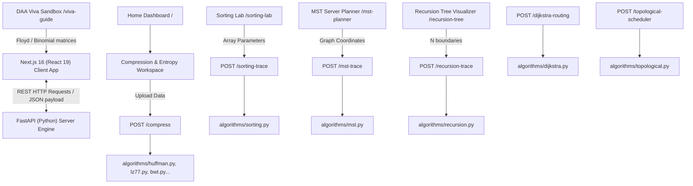
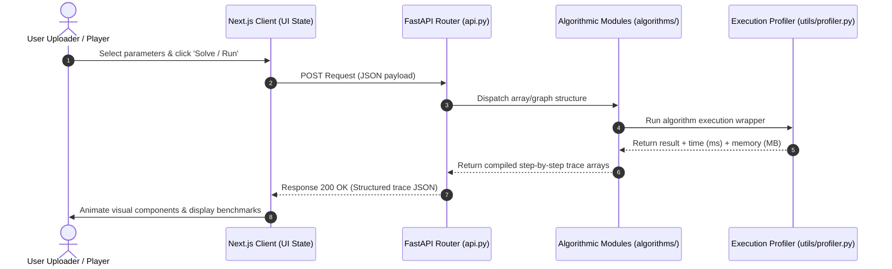

# ByteForge: Advanced DAA Algorithm Laboratory & Showcase Platform 🗜️📊

ByteForge is a professional-grade, highly interactive educational platform designed to benchmark, visualize, and analyze classic **Design and Analysis of Algorithms (DAA)** paradigms alongside advanced Information Theory and Lossless Data Compression engines. 

Developed as an academic showcase, it provides students, faculty members, and project evaluators with a hands-on, step-by-step visual sandbox mapping directly to core computer science syllabus modules.

---

## 🏗️ System Architecture & Data Flow

ByteForge is designed using a decoupled, high-performance client-server model:
1. **Frontend**: Next.js 16 (React 19) styled with Tailwind CSS, utilizing client-side SVG renderers for real-time algorithm state changes and step-by-step animations.
2. **Backend**: Python FastAPI service timing execution benchmarks at microsecond precision and generating structured trace dictionaries of intermediate variables.

### System Architecture Topology



### Request-Response Lifecycle & Data Flow



---

## 🌟 Core Features & Modules

### 1. DAA Algorithm Showcase Dashboard
* **Objective**: Present an integrated launchpad for the curriculum.
* **Internal Working**: Renders a card grid mapping directly to Unit I through V.
* **Expected Output**: Links the user to visualizer panels while maintaining the compression hub context below.

### 2. Compression & Entropy Engine (Unit IV Huffman & Dictionary)
* **Objective**: Compare Shannon entropy limits against lossless compression outputs.
* **Algorithms**: Huffman Coding, LZ77, LZW, RLE, Burrows-Wheeler Transform, Arithmetic Coding, DEFLATE.
* **User Flow**: User uploads text/binary data $\to$ selects engine mode (Naive vs. Optimized) $\to$ views Shannon limits vs. actual byte sizes, codebooks, and token logs.

### 3. Sorting Laboratory (Unit I & II Brute Force, Divide & Conquer, Transform & Conquer)
* **Objective**: Animate pivot partitioning, recursive splitting, and elements swapping.
* **Algorithms**: Bubble Sort, Selection Sort, Merge Sort, Quick Sort, Heap Sort, Counting Sort.
* **User Flow**: Enter comma-separated arrays $\to$ select algorithm $\to$ play/step trace frames.
* **Visual Representation**: Styled vertical bars where active comparisons turn cyan/accent, swaps flash red/destructive, pivots turn purple, and sorted subsegments turn green.

### 4. MST Server Planner (Unit IV Greedy Techniques)
* **Objective**: Formulate a minimum-weight spanning tree (MST) on a virtual server graph.
* **Algorithms**: Kruskal's (Union-Find) and Prim's (Priority Queue cut crossings).
* **Visual Representation**: SVG node-and-edge graph showing disjoint set mappings `parent[u]` and priority queue fringe weights dynamically.

### 5. Recursion Tree Visualizer (Unit I, II & IV Recursion & Memory Functions)
* **Objective**: Illustrate recursive tree expansion and stack frame pruning.
* **Algorithms**: Naive Fibonacci, Memoized Fibonacci (Dynamic Programming), Merge Sort splits.
* **Visual Representation**: SVG hierarchy showing nodes progressing through active (blue), cache hit (blue-cyan), and resolved (green) states.

### 6. DAA Viva Sandbox (Syllabus & Practice)
* **Objective**: Prepare students for external examiner questions and oral presentations.
* **Features**:
  * **Interactive Oral Simulator**: Q&A cards with structured outlines.
  * **Binomial Coefficient Solver**: Renders a bottom-up Dynamic Programming table where $C(i, j) = C(i-1, j-1) + C(i-1, j)$.
  * **Floyd-Warshall Shortest Path Solver**: Solves all-pairs shortest path matrices step-by-step ($D^{(0)} \to D^{(4)}$).

---

## 📚 Algorithm Reference & Complexity Matrix

| Algorithm | Syllabus Unit | Paradigm | Time Complexity (Best / Avg / Worst) | Space Complexity | Advantages | Limitations |
| :--- | :--- | :--- | :--- | :--- | :--- | :--- |
| **Huffman Coding** | Unit IV | Greedy Technique | $O(N \log N)$ | $O(N)$ | Provably optimal prefix codes for known frequencies. | Requires double-pass or transmitting codebook. |
| **LZ77** | Unit IV | Dictionary / Sliding | $O(N)$ (Opt) / $O(N)$ / $O(N^2)$ (Naive) | $O(W)$ window | Adapts to local redundancies. No codebook needed. | Slow encoding without rolling hash structures. |
| **Bubble Sort** | Unit I | Brute Force | $O(N)$ (Sorted) / $O(N^2)$ / $O(N^2)$ | $O(1)$ | Simple, checks if array is already sorted. | Extremely slow on large datasets. |
| **Selection Sort**| Unit I | Brute Force | $O(N^2)$ / $O(N^2)$ / $O(N^2)$ | $O(1)$ | Minimal swaps, good when write cost is high. | Redundant comparisons regardless of order. |
| **Quick Sort** | Unit II | Divide & Conquer | $O(N \log N)$ / $O(N \log N)$ / $O(N^2)$ | $O(\log N)$ | Fast in-place partitioning, high cache locality. | Sensitive to pivot selection (worst-case on sorted). |
| **Merge Sort** | Unit II | Divide & Conquer | $O(N \log N)$ / $O(N \log N)$ / $O(N \log N)$ | $O(N)$ | Stable sorting, guarantees consistent runtime. | Requires extra auxiliary memory block. |
| **Heap Sort** | Unit III | Transform & Conquer| $O(N \log N)$ / $O(N \log N)$ / $O(N \log N)$ | $O(1)$ | In-place, strict worst-case bounds. | Poor cache locality due to jumpy tree traversal. |
| **Counting Sort** | Unit III | Space-Time Tradeoff| $O(N + K)$ / $O(N + K)$ / $O(N + K)$ | $O(N + K)$ | Linear execution time for small integer limits. | Fails on fractional numbers or wide ranges. |
| **Dijkstra** | Unit IV | Greedy Technique | $O((V+E) \log V)$ | $O(V + E)$ | Fast shortest path routing on positive weights. | Fails on graphs with negative edge weights. |
| **Kruskal's** | Unit IV | Greedy Technique | $O(E \log E)$ | $O(V + E)$ | Excellent for sparse graphs. | Sorting all edges incurs global overhead. |
| **Prim's** | Unit IV | Greedy Technique | $O(E \log V)$ | $O(V + E)$ | Better for dense graphs. | Complex Priority Queue tracking per step. |
| **Floyd-Warshall**| Unit IV | Dynamic Programming | $O(V^3)$ / $O(V^3)$ / $O(V^3)$ | $O(V^2)$ | Simple matrix updates, handles negative edges. | Impractical on large graphs due to cubic runtime. |
| **Kahn's Sort** | Unit II | Decrease & Conquer | $O(V + E)$ / $O(V + E)$ / $O(V + E)$ | $O(V)$ | Easy cycle detection via remaining in-degrees. | Requires explicit pre-calculation of in-degrees. |

---

## 🛠️ Technology Stack & Selection Rationale

### Frontend Frameworks
* **Next.js 16 (React 19)**: Selected for its App Router structure, layout persistence, and static site generation (SSG) compiling.
* **Tailwind CSS v4 & PostCSS**: Selected for CSS-first styling configurations, providing glassmorphic panels and dark slate laboratory aesthetics.
* **Lucide React**: High-quality SVG icon package.

### Backend Engine
* **Python 3.11**: Excellent support for informational science and profiling, offering easy syntax matching for pure pseudocode.
* **FastAPI**: Exceptionally fast asynchronous REST routing with automatic Swagger API specifications.
* **Uvicorn**: Lightweight ASGI web server for fast local hosting.

---

## 📂 Project Structure

```
ByteForge/
├── algorithms/                  # DAA Pure Python Implementations
│   ├── arithmetic.py            # Precision range fraction coder
│   ├── bubble.py / sorting.py   # Bubble, Selection, Quick, Merge, Heap, Counting traces
│   ├── bwt.py                   # Burrows-Wheeler block sorting
│   ├── deflate.py               # LZ77 + Huffman hybrid standard
│   ├── dijkstra.py              # Dijkstra shortest path with relaxation logging
│   ├── entropy.py               # Shannon entropy calculations
│   ├── huffman.py               # Huffman codebook tree generator
│   ├── knapsack.py              # 0/1 Knapsack (DP) vs. Fractional Knapsack (Greedy)
│   ├── lz77.py                  # Sliding window lookahead dictionary encoder
│   ├── lzw.py                   # Lempel-Ziv-Welch dynamic indexer
│   ├── mst.py                   # Kruskal's (Union-Find) and Prim's MST solvers
│   ├── recursion.py             # Naive/Memoized Fibonacci, Merge split trees
│   ├── rle.py                   # Run-length frequency pair encoder
│   ├── string_matching.py       # Naive, Horspool's, Boyer-Moore search engines
│   └── topological.py           # Kahn's (In-degree queue) vs DFS topological sort
├── frontend/                    # Next.js 16 App Directory
│   ├── app/                     # App Router pages mapping directly to DAA visualizers
│   │   ├── analytics/           # Benchmark comparisons
│   │   │   └── page.tsx
│   │   ├── knapsack/            # DP 0/1 Knapsack matrix layout
│   │   ├── mst-planner/         # Kruskal & Prim SVG graph visualizer
│   │   ├── network-routing/     # Dijkstra latency router
│   │   ├── recursion-tree/      # SVG recursive call tree frames
│   │   ├── scheduler/           # Kahn's vs DFS topological course scheduling
│   │   ├── sorting-lab/         # Bar animations & sorting benchmark tables
│   │   ├── string-matching/     # Text sliding alignments visualizer
│   │   ├── viva-guide/          # Mock viva oral sandbox & DP table solvers
│   │   ├── globals.css          # Design system variables, slate navy oklch colors
│   │   ├── layout.tsx           # Main shell layout with floating math watermark overlays
│   │   └── page.tsx             # Interactive curriculum module launchpad
│   ├── components/              # Shared UI components
│   │   ├── sidebar.tsx          # Main sidebar navigation links
│   │   └── ui/                  # Component library buttons and cards
│   ├── tsconfig.json            # TypeScript compile configurations
│   └── package.json             # NPM package scripts & dependencies
├── api.py                       # Main FastAPI REST Controller & Request Models
├── generate_tests.py            # Diagnostic test files generator
└── README.md                    # Core project documentation
```

---

## 🚀 Installation & Setup

### Prerequisites
* **Python 3.10+** (verify with `python --version`)
* **Node.js 18+** & **npm 9+** (verify with `node -v` and `npm -v`)

### 1. Initialize Python Backend Service
Open a terminal in the project root:
```bash
# Install required dependencies
pip install fastapi uvicorn pydantic

# Start the server using uvicorn on port 8000
python -m uvicorn api:app --port 8000
```
The FastAPI documentation will now be accessible at `http://127.0.0.1:8000/docs`.

### 2. Initialize Next.js Frontend App
Open a new terminal window in the `frontend` subdirectory:
```bash
# Navigate to the frontend directory
cd frontend

# Install package dependencies
npm install

# Run the development server
npm run dev
```
The interactive platform is now live at `http://localhost:3000`.

---

## 🎓 Viva Voce Preparation Questions & Answers

### Q1: Why does Dijkstra fail on negative edges, and how does Bellman-Ford fix it?
> **Answer**: Dijkstra uses a greedy choice: once a node is popped from the Min-Heap queue, its shortest path is assumed final. A negative weight edge can bypass this assumption by providing a cheaper route to an already visited vertex. Bellman-Ford fixes this by avoiding greedy choices. Instead, it relaxes all edges $V-1$ times (Dynamic Programming), ensuring any path of length $V-1$ is fully computed.

### Q2: What is the benefit of Path Compression in Union-Find (Kruskal's)?
> **Answer**: Path compression flattens the tree structure of disjoint sets. Every time `find(i)` is called, we recursively make all traversed nodes point directly to the root of the set. This bounds subsequent lookups to nearly constant time, giving a time complexity of $O(\alpha(V))$ per operation, where $\alpha$ is the extremely slow-growing inverse Ackermann function.

### Q3: What is the optimal subproblem equation for 0/1 Knapsack?
> **Answer**: The decision at item $i$ with capacity $w$ is either to exclude the item or include it (if capacity permits):
> $$DP[i][w] = \max(DP[i-1][w], \text{value}[i-1] + DP[i-1][w - \text{weight}[i-1]])$$
> If the item's weight exceeds $w$, it must be excluded: $DP[i][w] = DP[i-1][w]$.

### Q4: Explain the difference between Horspool's and Boyer-Moore bad character shifts.
> **Answer**: Both align the pattern against the text window from right to left.
> * **Horspool's**: In a mismatch, it checks the last character of the current text window, looking it up in the shift table to slide the pattern.
> * **Boyer-Moore**: In a mismatch, it checks the actual mismatch character in the text, shifting based on its index relative to the pattern's alignment position.

---

## 📝 Conclusion
ByteForge demonstrates software engineering best practices applied to computer science education. By combining a high-performance Python engine with a modern Next.js client layout, it replaces abstract algorithmic descriptions with step-by-step visual proofs. It provides students with a project structure to demonstrate time-complexity, space-time tradeoffs, and greedy-versus-dynamic programming optimizations during coursework presentations and viva reviews.
